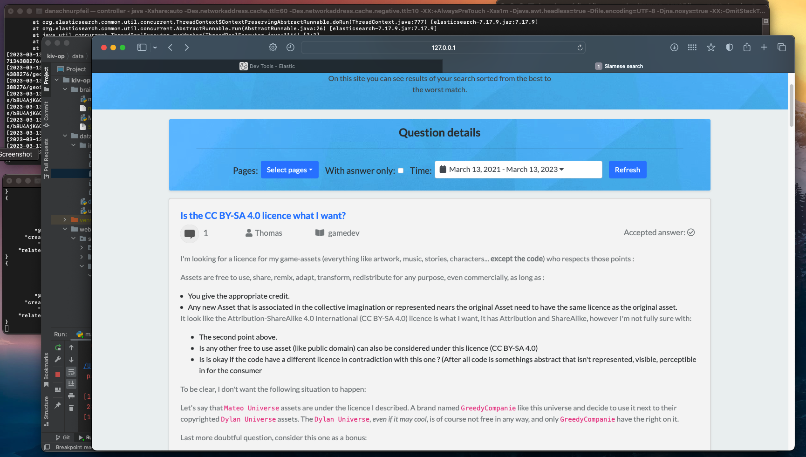

# kiv-op

- ✅ Explore the provided model to search for similar issues and learn how to input and output. 

-  ✅ Index the off-line Stack Overflow database in a suitable search engine (Elasticsearch is recommended)

- Create a web application that allows you to enter a question and accompanying source code. The application will search for the most similar question from the off-line Stack Overflow database for this input. Finally, it will allow automatic entry of the question into the Stack Overflow portal.

