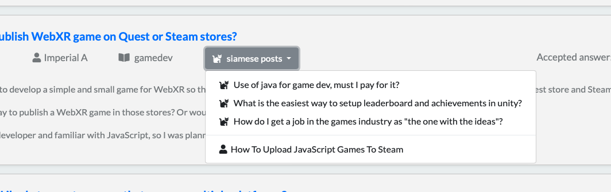

## Stackexchange Siamese Posts Search

How to run it:

- save data for indexing from [Google drive](https://drive.google.com/drive/folders/19_TiBVPyBIsaVLH1p_Pv6271HpJvGUI7) or [One Drive](https://onedrive.live.com/?authkey=%21AHBhGMYxGeNPeK0&id=8D9B8AAC1B2B5597%2185158&cid=8D9B8AAC1B2B5597)
and faiss indexed data from same zip. 
- put **Body.index** to `<project_dir>/web/search/indexed_data/Body.index`
- put (Badges.xml
Comments.xml
PostHistory.xml
PostLinks.xml
Posts.xml
Tags.xml
Users.xml
Votes.xml) to `<project_dir>/logstash/data/` directory

- run  `docker-compose up`  

- wait until logstash is finished... 

- like this picture above

Notes 

- if the app need to be restarted: 
  - delete ( dead_letter_queue
plugins
queue
.lock
uuid) from `<project_dir>/logstash/data/` directory

### What is done?

- extending [web application](https://github.com/janpasek97/stackoverflow-siamese-network) by:
    - [MQDD - Multimodal Question Duplicity Detection](https://arxiv.org/abs/2203.14093) which searches for similar questions among the first results of a user query. This approach showed that the inference of the MQDD model is not fast enough to run 50-500 times in real time on ordinary CPU.

 - creating scripts for file-based index for similarity search [Faiss](https://github.com/facebookresearch/faiss) library and its support in app

- docker support of the web app

